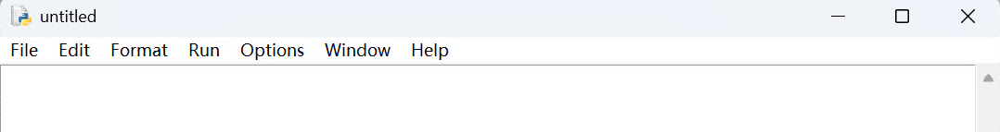

### 1. Python环境与工具
#### 1.1. 编程模式，（脚本模式和交互模式）
1. **谐音记忆法：**
* **脚本：** “脚笨”→ 写完再运行，一步到位。 口诀：“脚笨模式，一步到位！”
* **交互：** “叫好”→ 一行一执行，立马出结果；口诀：“叫好模式，随叫随到！”
2. **交互模式特征：**
* 启动IDLE后显示 `>>>` 及版本号（如 `Python 3.11.5`），表示进入**Python Shell交互模式**。
* 逐行执行代码，支持多行输入（如函数/循环），但无法直接保存会话。

3. **脚本模式（文件执行）：**
* 不会显示版本号
* 需先保存为 `.py` 文件再运行，适合完整程序。

4. **命令行执行**
在Windows的CMD中，运行Python脚本的命令应为 `**python** test.py或**py** test.py`（而非 `**python3**`，**除非配置了别名**）。


#### 1.2. 环境 VS 编辑器
1. **Python环境与编辑器的区别**
* **Python环境**：必须安装解释器（如从官网下载），否则无法运行代码。
* **编辑器**：仅编写代码的工具（如Visual Studio Code(vscode)、IDLE、JupyterNotebook、Pycharm、文本编辑器），需依赖Python环境执行。
2. **执行程序的常见方式**
* 在IDLE中通过 **Run → Run Module（F5）** 执行代码。
3. **语法一致性**
* 代码语法与编辑器无关（如PyCharm与IDLE中的 `print()`写法一致）。
#### 1.3. 文件管理规范
* Python文件扩展名为 `.py` `.pyw`，系统不区分大小写（`.PY`也可以）。
* turtle这个词比较重要，无法被保存为**turtle.py**
#### 1.4. Python版本与兼容性
1. **Python 2 vs. Python 3**
* 两者语法不兼容（如 `print`语句在Python 2中无需括号）。
* Python 2已停止维护，推荐使用Python 3。
2. **安装包区别**
3. **32位与64位安装包不可混用**
* 32位的电脑不支持64位版本的python
* 64位的电脑支持32位版本的python
#### 1.5. 其他注意事项
1. **费用与授权**：Python完全免费，可商用无需付费。
2. **常见误区**
* **Scratch**：图形化编程工具，不支持Python。
* **IDLE代码颜色**：实际支持语法高亮（若题目称“单色显示”，则为错误描述）。
* **执行速度**：与Python版本无关（实际性能可能因优化有差异，但非版本核心区别）。
#### 1.6. 代表性真题
1. 在Python编程环境下，IDLE代表什么？
   A 编辑器    B 编译器   C计算器    D集成开发环境
    ```
    D
    ```
2. 下列哪个操作不能退出IDLE环境？
   A.Alt+F4 B.Ctrl+Q C.按ESC键 5.exit()
    ```
    C
    ```
3. 在用IDLE脚本方式编写程序时，可以用ctrl+s快捷键保存代码。正确 错误
    ```
    正确
    ```
4. Python中，用什么方式实现代码快速缩进？
   A.按4次空格键 B.tab键 C.shift+tab键 D.Alt+tab键
    ```
    B
    ```
5. Python文件的后缀名可以使.py和.pyw。？正确 错误
    ```
    正确
    ```
6. IDLE环境的退出命令是？
   A.esc() B.close() C.回车键 D.exit()
    ```
    D
    ```
7. IDLE 的命令行模式和函数模式可以相互转换？正确 错误
    ```
    正确
    ```
8. 创建一个新的Python程序，编写了下面的代码
   import turtle
   turtle.shape("turtle")
   保存这个Python文件并且取了文件名。以下哪个文件名程序可以正常运行？
   A. frist.py  B.turtle.py     C.import.py3     D.hao.sb2
    ```
    B  turtle.py这个词比较重要，无法被保存为turtle.py
    ```
### 2. Python语言
#### 2.1. 语言特点
1. 是一种**面向对象**的编程语言。不是**面向过程**的编程语言
* **面向对象**：关注的是事物本身及其相互作用。比如积木，每个对象都有自己的属性（如颜色、形状）和方法（如如何连接到其他积木）。通过组合不同的对象，你可以构建复杂的系统。
* **面向过程**：关注的是如何一步步完成任务。比如打扫房间，你会先整理床铺，再扫地，然后擦桌子。每一步都是独立的任务，最终完成整个打扫过程。
2. **简洁易读**：Python 采用简洁的语法和语义，使得代码易于阅读和理解、库文件丰富，可以用在很多应用领域。
3. **动态类型**：Python 是一种动态类型的语言，不需要声明变量的类型
4. **多平台支持**：Python 可以在多种操作系统上运行，包括Windows、Linux、Mac OS等，可以实现跨平台的开发和部署
#### 2.2. 代表性真题
1. 下面描述中，不符合Python语言特点的是？
   A.Python是一门面向对象的编程语言 B.Python程序通过编译后执行 C.Python支持函数编程 D.Python支持多个操作系统
    ```
    B
    ```
2. 关于Python的表述，下列不正确的是？
   A. Python是一种解释型程序设计语言； B.Python是一种面对对象型程序设计语言；
   C. Python是一种动态数据类型程序设计语言； D.Python是一种编译型程序设计语言。
    ```
    D
    ```
### 3. type与eval
#### 3.1. eval
是 Python 的内置函数，用于**动态执行字符串形式的 Python 表达式**，并返回计算结果。
#### 3.2. type
type()函数用于返回对象的类型，type的返回结果取决于括号里的类型
```
print(type("hello"))  #注意数字引号也返回int，比如"123"
print(type(123))
print(type(3.14))
print(type(True))
###输出如下
<class 'str'>
<class 'int'>
<class 'float'>
<class 'bool'>
```
#### 3.3. 代表性真题
1. print(type(16/4)) 返回什么？
    ```
    <class 'float'>
    ```
2. print(type(8//2))
    ```
    <class 'int'>
    ```
3. print(type(eval("3.3+5")))
    ```
    <class 'float'>
    ```
4. print("123")
    ```
    <class 'str'>
    ```
5. a=1.27
   print (eval('a+10'))
   上述代码的执行结果是？
   A.1.2710 B. 系统报错 C.11.27 D.1.27+10
    ```
    C
    ```
### 4. 变量定义与赋值
#### 4.1. 保留字（或关键词）：
1. **turtle**不属于保留字
2. **as、is**是保留字，容易被忽视
3. **true、false**不是保留字，保留字的首字母大写的**True，False**。误导题
4. 任何保留字都不可以作为变量来使用
#### 4.2. 变量命名
1. 在 Python 中，变量命名需要遵循以下规则：
   ✔变量名可以包含**字母、数字和下划线**（\_）。
   ✔ 变量名**区分大小写**（`score` 和 `Score` 是两个不同的变量）。
2. 如下变量名判断正确和错误
   判断对错：123、 abc、 \_123、 \_abc、 and、 an-d、 1\_and、 and1、2\_5、s
    ```
    123  abc  _123   _abc  and  an-d  1_and  and1   2_5   s
     ×    √     √     √     ×     ×     ×      √     ×    √
    ```
#### 4.3. 变量赋值
1. 变量的设定和赋值是同时进行，不需要分开；比如a=1
2. Python是动态语言，命名变量时，不需要声明变量的数据类型，比如a=1，不用写成int a=1
3. 同一行
* Python可以同一行显示多条语句，方法是在语句中间用分号“；”分开。a=1; b=2; c=3
* a,b=1,3，可以这样写，则相当于a=1；b=3
* a=b=c=5，可以这样写最后a、b、c都等于5
4. 在一个程序中，同一个变量可以有不同的数据类型。例如下面，第一行a的数据类型为int，第三行a的数据类型为str
    ```
    a=1
    print(type(a))
    a="2"
    print(type(a))
    #输出为
    <class 'int'>
    <class 'str'>
    ```
5. 判断变量赋值的对与错
   `x+y=10` `x-2=2y` `x=30` `3y=x+1` `10=num`  `num==10`  `int num=10` `num=10`
     ×          ×            √           ×       ×           ×               ×               √
#### 4.4. 代表性真题
1. 变量和常量的区别在于，在程序运行过程中，变量的值是可以发生变化的量，而常量是不发生变化的量。正确 错误
    ```
    正确
    ```
2. 变量的设定和赋值不能同时进行，需要分开使用两条语句。正确 错误
    ```
    错误
    ```
3. 命名变量时，一定要声明变量的数据类型才可以。正确 错误
    ```
    错误
    ```
### 5. 模块导入
import turtle
import turtle as t
### 6. 输入与输出与引号
#### 6.1. input
* 接受的键盘的输入，是字符串类型，如果需要数字一定要转换。
* input()语句并**不能输入一个指令**，而是用来获取控制台的输入，返回的数据类型是字符串类型。
#### 6.2. print
* print语句可以输出文本、字符串、数字、布尔等。
* 如果输出字符串，print括号里一定需要引号
  `print(北京)` `print('北京')` `print("北京")` `print('Hello, World!")`
    ```
    ×           √            √          ×
    ```
* print()输出相关内容后默认会换行
  `print('hello')`
  `print('world')`
* print("hello", end='')，当出现 end=''是代表删除了最后面的换行，此时就不换号
* print('hello','world)，中间使用英文逗号分隔时，逗号替换成空格，最终输出。`hello world`
#### 6.3. 引号
双引号""和三引号"""，这个是最大的区别是是否可以跨行，即多行
#### 6.4. 代表性真题
1. 已知a=4,b=7，那么print(a>b)输出的结果是？
   A.False B.True C.32 D.5
    ```
    A
    ```
2. 执行print('"10+20="10+20')后，结果等于？
   A.10+20=30 B."10+20"=30 C.报错 D."10+20="10+20
    ```
    D:引号多了容易误判，注意成对
    ```
3. input()语句是用来输入一个指令。正确 错误
    ```
    错误：input()语句并不能输入一个指令，而是用来获取控制台的输入，返回的数据类型是字符串类型。
    ```
4. 使用print("Hello","World")和print("Hello World")输出的结果相同。正确 错误
    ```
    正确：使用print()函数在一行中输出多个内容时，中间使用英文逗号分隔，最终输出结果中两个元素间多一个空格，即为Hello World，与第二条语句输出结果相同，故本题说法正确。
    ```
5. 在Python中，语句 print(a,b) 的功能是？输出a, b的值
   A.打印a, b B.输出(a, b) C.输出a, b D.输出a, b的值
    ```
    D
    ```
6. Python 中，成对使用的单引号或双引号包围的字符串是完全相同的。正确 错误
    ```
    正确：
    ```
7. 在Python中，执行print("3+2")语句得到的结果是"5"。正确 错误
    ```
    错误：print语句中，引号内的字符不可发生变动，正确输出应为3+2。
    ```

### 7. 数学运算与表达式
#### 7.1. 运算符
1. 乘法\*
* 字符串与数字相乘时，就和幂运算一样，`print(5\*'A')``print('A'\*5)`这两个print都会输出`AAAAA`,5个A。
作者感悟：动态语言的魅力，当语言太灵活时是好是坏呢？做产品也得考虑极简性，傻瓜式使用，尤其编程语言也考虑规范性。
2. 除法/
* 结果一定是浮点数，默认一个小数点，取余、取整是int类型
3. 加法+
* 多个字符串之间用"+"代表的将字符串连接起来，字符串之间用"-"会报错。
√ print("hello"+"word")
× print("hello"-"word")
#### 7.2. 运算式
1. 等号左侧有，运算符时，举例如下：
a = 5
a -= 1
`a -= 1相当于a = a-1，减号可以换成其它运算符。`
### 8. 数据类型与转换
#### 8.1. int、float、bool、str
* 非数值的字符串无法转数字类型，比如`'a'`无法转换`int('a')``float('a')`
* 浮点数的字符串无法转int类型，比如`int('12.3')`运行会报错，必须转float后，再转int
* float转int时，省略小数点：`print(int(12.3))`，输出结果是`12`
#### 8.2. 代表性真题
1. str(10)运行结果是'10'。正确 错误
    ```
    正确：str()函数是将其他数据类型转换为字符串类型，所以输出的结构是有引号的。
    ```
2. 可以使用 int() 将字符串类型的 '3.14' 转换为整数类型的 3。正确 错误
    ```
    错误：浮点数的字符串无法转int类型
    ```
3. 下列程序运行的结果是？
a=5
b=2
a-=b
print(a)
A.4 B.1 C.3 D.2
    ```
    C
    ```
4. 已知以下程序，请问输出结果是？（）
a = int(6.8)
b = float(7)
a = a + b
print(a, b)
A.14 7.0 B.14.0 7.0 C.13.0 7.0 D.13.0 7
    ```
    C
    ```
5. 已知表达式“3+8/4+False”（不包含引号），其输出结果的数据类型为？
A.int B.bool C.float D.语法错误
    ```
    C:除法结果一定是浮点数
    ```
6. print(int(12.67))，输出结果是13。正确 错误
    ```
    错误：int转换时，不需要进位，直接截取
    ```
### 9. 注释
#### 9.1. 单行与多行
* 单行注释：`#`
* 多行注释：要相互匹配，成对出现。`''' '''` `""" """`
#### 9.2. 代表性真题
1. 在用Python进行编程时，代码后面常用“#”并在后面加上一些说明文字内容，在这里“#”作用是？
    A.换行    B.转换数据类型        C.输出        D.注释
    ```
    D:
    ```
2. 可以对Python代码进行多行注释的是？（　）
    A.#     B." "   C.''' '''       D.' '
    ```
    C:#是单行注释，三引号，包括单三引号和双三引号可以用于跨行注释，所以选C。
    ```
3. 下列程序中，注释的使用有错误，但是不知道有几处是错误的，请找出来有几处错误？（　）
    01  a = float(input('输入第一条边长：'))  #输入第一条边
    02  b = float(input('输入第二条边长：'))  #输入第二条边
    03  c = float(input('输入第三条边长：'))  #输入第三条边
    04  """
    05  求周长的一半
    06  '''
    07  p = (a+b+c)/2
    A.1处错误   B.2处错误      C.3处错误      D.0处错误
    ```
    A:引号没有成对
    ```
### 10. 程序结构与缩进
#### 10.1. 知识点
* Python程序必须按照层级进行缩进，Python是不会自动识别代码之间的关系的。
* 同一个级别，缩进格式要一致，所以不能混用：
* 大部分缩进习惯，默认四个空格，tab默认也是四个空格
#### 10.2. 代表性真题
1. 在编写较长的Python程序时，所有代码都不需要缩进，Python会自动识别代码之间的关系。正确 错误
    ```
    错误：Python程序必须按照层级进行缩进，Python是不会自动识别代码之间的关系的。
    ```
2. Python代码的缩进，在同一个程序中，同一级别缩进中，两个空格和四个空格不可以混合使用。正确 错误
    ```
    正确：同一个级别，缩进格式要一致，所以不能混用。
    ```
3. 在Python中，缩进是用来表示代码块的层级关系的，可以通过使用空格来缩进代码，每增加一个层块，就增加几个缩进？
A.半个    B.一个    C.一个半   D.任意个都可以
    ```
    B:在Python中缩进是必须的，如果缩进不正确，会导致语法错误，所以每增加一个层块，就增加一个缩进。
    ```
### 11. 逻辑运算符与布尔与优先级
#### 11.1. and（逻辑与）or（逻辑或）
* **and：** 理解为并且，两边同时为True时，结果为真。
* **or：** 理解为或者，两边任意一个条件为真时，结果为真。
* **最短路径求值**：
    + `or` 遇到 `True` 就停， 不再继续计算剩下的部分。
    判断一个数是否为偶数，或者是大于4
    (num % 2) ==0 or num > 4
    如果num=2，第一段判断为True，后面就不会再判断
    如何num=3，第一段判断完False后，继续判断第二段是否大于4
    如果第一个条件是False，则会依次看第二个、第三个条件。
    + `and` 遇到 `False` 就停， 不再继续计算剩下的部分 。
    判断一个数是否为偶数，并且是大于4
    (num % 2) ==0 and num > 4
    如果num=3，第一段判断为False，后面就不会再判断
    如何num=2，第一段判断完True后，继续判断第二段是否大于4
    如果第一个条件是True，则会依次看第二个、第三个条件。
#### 11.2. True与False
* 数字**0**与**False**相同
* 数字0**以外**的数组、字符串等都维护**True**
#### 11.3. == 与 =
* ==是比较运算符；=是赋值运算符
* `1.0==1` 比较的结果是True
* `"python"=="Python"`比较的结果是False
#### 11.4. 字符串比较总结
在Python中，字符串比较基于字符的Unicode码点值进行。对于初学者有点繁琐，暂时记忆如下内容，应该可以应付考试。在实际的编程项目里面也没有人记忆这个东西吧。
* 'A' < 'a': **True**
大写字母小于小写字母，规律来记忆。
* 'a' < 'b': **True**
按照后面的字母比前面的大，规律来记忆
* '1' < '2': **True**
按照正常的数字来记忆。
* '11' < '2': **True**
位数不同时，看对应位数谁大，则就大。如果示例为'11' 与 '1': 比较，则11大
#### 11.5. 优先级
依次从上到下、从左到右向低排序
1. 括号
2. 算术运算符：`\*\*` > `~`, `+`, `-` > `\*`, `/`, `//`, `%` > `+`, `-`
3. 比较运算符：`<`, `<=`, `>`, `>=` > `==`, `!=`
4. 逻辑运算符：`not` > `and` > `or`
5. 赋值运算符：=
#### 11.6. 代表性真题
1. 运行指令3\*\*2 > 2\*3 and 6 < 5，请问根据运算的优先级，首先进行哪一部分的运算？
A.2>2   B.3\*\*2    C.3 and 6   D.2\*3
    ```
    B
    ```
2. 运行程序：print(not(5\*2+6) > 8+3\*3)，它的输出结果是？
A.False     B.True  C.1     D.无法确定
    ```
    B:
    第一步：计算括号内的值
    5 * 2 + 6
    5 * 2 = 10
    10 + 6 = 16
    所以，(5 * 2 + 6) 的值为 16。
    8 + 3 * 3
    3 * 3 = 9
    8 + 9 = 17
    所以，8 + 3 * 3 的值为 17。
    第二步：处理 not 运算符
    根据 Python 的运算优先级，not 的优先级低于比较运算符（如 >）。因此，先计算比较部分 (5*2+6) > (8+3*3)，然后再应用 not。
    (5 * 2 + 6) > (8 + 3 * 3)
    即 16 > 17，结果为 False。
    然后对这个结果应用 not：
    not False 的结果是 True。
    第三步：输出结果
    最终表达式的值为 True，因此程序的输出是：
    ```
3. 如果a=145，b=90，c=a>b，那么c的值是？
A.False     B.90    C.145  D.True
    ```
    D:根据优先级顺序，先算a>b为True，然后赋值给c
    ```
4. print(2023 % 10 \*\* 2)的结果是？
A.200   B.23    C.20    D.20.23
    ```
    B:
    第一步：计算幂运算 10 ** 2，即 10×10=100
    第二步：计算取模运算 2023 % 100=23
    第三步：输出结果23
    ```
5. 在Python中输入80/4//3,计算结果为6.0。正确 错误
    ```
    正确:
    注：//、%的分子、分母可以是浮点数，如果有一个是浮点数，则结果为浮点数
    ```
6. 观察下列程序，程序运行后输出结果是？
01 x=6; y=7;
02 z=3\*(12/x)+(x-5)/(y-6)
03 print('z=',z)
A.7     B.7.0   C.z= 7      D.z=7.0
    ```
    D:
    快速判断，所有答案都是7，
    print里面有一个引号z=,则输出一定带有z=,
    因为有除法，最终结果一定会出现小数点，这样不用计算就可以知道答案是D
    ```
7. 以下程序运行的结果是？（　）
print(1<2 and 2<3 or 4>5)
A.True      B.False      C.1      D.2
    ```
    A:
    根据运算优先级，1<2 and 2<3 or 4>5 先进行比较运算，该式子可以转化为：Ture and Ture or Flase，再根据运算优先级，先进行and计算，Ture and Ture 的运算结果为Ture，该式子转换为Ture or Flase，根据or运算的规则，当第一个为Ture，则返回第一个的值，所以结果为Ture，所以选A。
    ```
8. 下列代码的运行结果是？（　）
a=3 and 2
b=3 or 4
print(a+b)
A.7         B.7.0       C.z= 7        D.z=7.0
    ```
    A:
    ■ a=3 and 2，根据优先顺序先看3 and 2，and最左侧的是True，则继续看右边，如果是True则返回True，如果是数字返回数字，总之是什么返回什么。所以a=2
    ■ b=3 or 4，根据优先顺序先看3 or 4，or最左侧的是True，则停止运行，直接返回该数，是什么返回什么。所以b=3
    ```
9. 已知
a=True
b=False
c=True
执行语句print（not a and b or c)，结果为？
A.True       B.False       C.1         D.0
    ```
    A:
    ■ 根据优先顺序先看not a为False
    ■ 再看and，因为最左侧为False,则and结果为False,
    ■ 再看or，因有一个为True，则or结果为True
    本地更快速的判断方法是，直接看最小优先级or，因为or最右侧为True,根据最短路径，整体为True
    ```
10. print(1<2 and 3<2 or 3<4 and 'a'!='a' or not 2+3>=6)的结果是？
A.False     B.True      C.2         D.1
    ```
    B:
    本地根据上题思路，利用最低的优先级来反推更快
    ```
11. 逻辑运算符中（注意不是所有的运算符，只是逻辑运算符），优先级最高的是？
A.or        B.and       C.not       D.\*\*
    ```
    C:迷惑题，容易选择非逻辑运算符**
    ```
12. 小奇参加知识竞赛，晋级条件是语文成绩和数学成绩必须等于或高于90分，用程序描述，以下哪个条件语句才是正确的？
A.语文成绩>=90 and 数学成绩>=90         B.语文成绩==90 and 数学成绩==90
C.语文成绩<=90 and 数学成绩<=90         D.语文成绩>=90 or 数学成绩>=90
    ```
    A:并且的意思，需要同时满足条件
    ```
13. 假设a=True, b=False，那么a and b的结果是？
A.True      B.False     C.1     D.a=True,b=False
    ```
    B:
    根据and运算规则，当and前面值为真时，返回的值时and运算的后面的值，即：False。
    ```
14. 下列表达式的值为True的是？（ ）
A.'a'>'b'       B.2>3       C.'A'>'a'       D.'3'>'2'
    ```
    D:
    ```
15. 下列代码的运行结果是？
print('a'< 'b')
A.a         B.b         C.True      D.False
    ```
    C:
    ```
### 12. turtle
#### 12.1. turtle基础库操作
1. 导入：
import turtle
import turtle as t
2. turtle是python内置的标准库, 直接使用import turtle导入使用即可, 不用额外安装
3. 判断对错：执行turtle.hideturtle()命令隐藏海龟之后，再怎么移动也就不能在画布上画图了
4. 一个画布中可以有多个海龟，如下代码就有2个海龟
import turtle
a=turtle.Turtle()
b=turtle.Turtle()
#### 12.2. turtle画布
##### 12.2.1. setup(width, height, startx=None, starty=None)，
    设置窗口大小和位置，width和height可为像素（整数）或相对屏幕宽度的比例（浮点数）。width默认值为0.5（即屏幕宽度的一半）,height默认值为0.75（即屏幕高度的四分之三）。
    startx和starty为窗口左上角为(0，0)的坐标，是像素值（整数），写法如下：
    turtle.setup(0.5, 2/3)
    turtle.setup(800, 600, 100, 100)
##### 12.2.2. 代表性真题
1. turtle库中的setup()指令既可以设置画布的大小也可以设置画布的位置。正确  错误
    ```
    正确
    ```
2. 在turtle中可以用setup()设置画布的大小和起始位置。已知画布的设置参数为turtle.setup(120,120,20,20),若只想更改画布的高度为150，下列指令设置正确的是？
A.turtle.setup(150,120,20,20) B.turtle.setup(120,150,20,20)
C.turtle.setup(120,120,150,20) D.turtle.setup(120,120,20,150)
    ```
    B
    ```
3. 在turtle库中对画布进行如下设置turtle.setup(width=400, height=300, startx=200, starty=100)，关于该指令描述正确的是？
A.画布宽200、高100 B.画布宽300、高400 C.画布宽400、高300 D.画布宽100、高200
    ```
    C
    ```
4. 小明同学自从学习Python语言的Turtle画图后，喜欢上了用程序作画，今天他想程序运行一开始画布就全屏显示，那么应该怎么设置画布的大小和位置？
A.turtle.setup(0, 0) B.turtle.setup('100%', '100%', 0, 0) C.turtle.setup(1.0, 1.0) D.turtle.setup(100, 100, 0, 0)
    ```
    C
    ```
#### 12.3. turtle绘图方向与坐标
##### 12.3.1. 知识点讲解
1. 改变方向的命令有**right**、**left**、**setheading**，如果没有这几个命令方向不会改变的
2. 坐标：中间为（0, 0），分别代表X, Y，重点需要知道正负号

3. home：小海龟返回原点后，方向为初始方向，但是画笔的颜色等设置依然保留。
##### 12.3.2. 代表性真题
1. turtle.home()指令的作用是让小海龟返回原点，在小海龟返回原点后，画笔的颜色等设置不再保留。正确 错误
    ```
    错误
    ```
2. 执行完下列代码后，坐标的位置是？
import turtle
turtle.penup()#抬起画笔
turtle.goto(-50,0)
turtle.pendown()
turtle.forward(100)
turtle.right(90)
turtle.forward(100)
turtle.done()
A.(0, 0) B.(-50,0) C.(50,-50) D.(50,-100)
    ```
    D
    ```
3. 执行以下命令后，turtle的最新坐标是？（ ）
import turtle
turtle.goto(-200,-200)
turtle.forward(200)
turtle.left(90)
turtle.forward(200)
A.(-200,200) B.(200,-200) C.(0,0) D.(0,200)
    ```
    C
    ```
4. 在海龟画图中，turtle.forward(100)指令可以让小海龟向前走，turtle.backward(100)指令可以让小海龟向后走，同时小海龟的头会转向相反的方向。正确 错误
    ```
    错误
    ```
5. 小海龟初始在坐标 (0,0) 的位置，方向朝左，在执行 turtle.goto(100,0) 后，小海龟会往右移动100，并且方向朝右。正确 错误
    ```
    错误
    ```
#### 12.4. turtle速度与动画控制
1. **speed(n)：** 设置绘图速度为`n`。
* `0`：无动画效果，瞬间完成动作（最快）。
* `1`：最慢
* `2-9`：逐渐加快。
* `10`：最快（有动画效果的情况下）。
2. **tracer(n)：** 控制动画速度，不常用，考试很少出现（`tracer`控制动画速度，`speed`控制画笔移动速度）
#### 12.5. turtle颜色与画笔设置
##### 12.5.1. 知识点讲解
1. pen开头的都是画笔相关内容
2. `turtle.begin\_fill() turtle.end\_fill()`：标记图形填充颜色的起点和结束，必须成对使用。与下面的fillcolor和color配合使用。
3. `pencolor()`、`color()`、`fillcolor()`讲解
* color只写一个参数时，并且前后添加了`begin\_fill和end\_fill`时，则为填充该颜色。例如下面代码为填充红色的圆。
=
所以当同时写`color("red")`，`fillcolor("yellow")`，则相当于`color("red"，"yellow")`
* turtle.fillcolor(color)指令中，color代表的是填充颜色，填充颜色需要在填充前进行声明，否则以默认颜色或者上次的填充颜色来填充。
4. `turtle.begin\_fill() turtle.end\_fill()`：标记图形填充颜色的起点和结束，必须成对使用。与fillcolor和color做配合。
**注意**：color只写了一个参数时，如果用到了这两个函数，则填充该颜色。如果同时写color("red")，fillcolor("yellow")则可以认为是color("red"，"yellow")
##### 12.5.2. 代表性真题
1. 执行下列turtle库的指令后，画笔最终为哪种颜色？
import turtle
turtle.pencolor("blue")
turtle.color("red", "green")
turtle.fillcolor("yellow")
A.红色 B.蓝色 C.绿色 D.黄色
答案A
2. turtle.color("red", "blue")
turtle.circle(120,steps=3)
可以画出一个边框为红色，里面填充颜色为蓝色的三角形。正确 错误
```
错误
```
#### 12.6. turtle圆
##### 12.6.1. `circle(radius, extent=None, steps=None)与dot(size=None, color=None)`区别
* **circle：参数1为半径**
* **dot：**圆点的**直径**
* **绘制时不移动画笔**:
+ `dot()` 会在当前位置绘制圆点，但不会移动画笔位置
+ 与 `circle()` 不同，绘制后画笔位置和方向保持不变
* **不受画笔状态影响**:
+ 即使画笔是抬起状态 (`penup()`)，`dot()` 仍然会绘制
+ 绘制圆点不会影响画笔的移动轨迹
* **颜色设置**:
+ 可以单独设置圆点颜色，不影响当前画笔颜色
+ 如果没有指定颜色，则继承当前画笔颜色
##### 12.6.2. 代表性真题
1. 小海龟正在绘制主题电子小报，需要在画布上绘制一个直径为50的圆(实心或空心)，下列哪条指令可以帮助小海龟完成绘制？
A.turtle.dot(100) B.turtle.dot(50) C.turtle.circle(50) D.turtle.circle(100)
    ```
    B
    ```
2. 调用turtle库指令，不可以只是用一行并且是一个指令直接绘制的图形是？
A.圆形 B.等边三角形 C.正方形 D.直角三角形
    ```
    D
    ```
3. 要绘制一个内径（六个顶点到中心点的距离）为100的正六边形，横线处的代码应该是？
import turtle
turtle.pendown()
turtle.circle(\_\_\_,\_\_\_,\_\_\_)
turtle.penup()
turtle.done()
A.100，90，6 B.50，90，6 C.100，360，6 D.100，6，360
    ```
    C
    ```
4. circle(100,steps=4),指的是绘制一个边长是100的正方形？正确 错误
    ```
    错误
    这里的100指的是圆的半径，而不是正方形的边长。因此，如果你想要得到一个边长为100的正方形，你不能直接使用circle(100, steps=4)，而是需要通过其他方式来指定每个边的长度。
    ```
5. 关于以下代码的说法正确的是？（ ）
t = int(turtle.textinput('边数','几边形：'));
turtle.circle(50, steps=t);
turtle.done();
A.circle是画圆的代码，因此该程序运行后的图案一定是圆 B.运行该程序后，需要用户自己输入边数，确定画 “几边形”
C.变量t没有给出具体的数值，因此该程序运行有错误 D.该程序运行后，会画出50个圆
    ```
    B
    ```
6. 以下代码可以召唤出几只小海龟？（ ）
import turtle
a=turtle.Turtle()
b=turtle.Turtle()
c=turtle.Turtle()
a.forward(100)
b.goto(100,100)
c.goto(100,100)
A.1 B.2 C.3 D.4
    ```
    C
    ```
### 13-数学问题与逻辑推理
这个部分指列举常见题型，其实还有很多数学相关的知识点。
1. “爷爷，您今年多少岁了？”小明问，爷爷想考考小明，于是告诉他：“我现在的年龄加上18，除以6，减去5，最后乘以10，恰巧是100岁。”你知道小明的爷爷今年多少岁？（）
A.68 B.70 C.72 D.78
    ```
    C
    ```
2. 小明手里有20个乒乓球，一个盒子最多可以放3个，请问以下运算哪个可以帮助小明计算出至少需要多少个盒子？
A.20/3+1 B.20%3 C.20//3 D.20//3+1
    ```
    D：最好的答案是D,但是如果是18个球呢，就不通用了
    方法二：找到一个通用公式
    首先列举数量观察
    3/3=1...0   需要1个盒子
    4/3=1...1   需要2个盒子
    5/3=1...2   需要2个盒子
    6/3=2...0   需要2个盒子
    7/3=2...1   需要3个盒子
    8/3=2...2   需要3个盒子
    当余数不为0时，则需要增加一个盒子（可以观察到余数为0,1,2，规律为3-1）
    所以当我们3-1时，就可以判断在有余数的情况下，让总和超过下一个整数，从而在整除时自动进位。
    这样我们使用(20+3-1) // 3就可以自动处理余数。
    假设有N个球，每个盒子最多放K个，公式 (N + K - 1) // K 都能自动处理余数：
    如果余数是0，结果不变；
    如果余数>0，结果自动加1。
    ```
3. 编写一个程序，实现下面的功能：输入1个三位数时，自动会输出这个三位数的十位上的数字。小明已经写好了程序，但是由于不小心把第二行程序给删掉了
第一行代码是number=int(input("请输入一个三位数")) ，
最后一行的代码分别是print(number\_2)。
请您帮小明选择下面哪个程序代码作为中间一行代码才是正确的？
A. number\_2=(number-number//100\*100)//10 B.number\_2=(number-number%100\*100)%10
C.number\_2=(number-number\*\*100\*100)\*\*10 D.number\_2=(number-number/100\*100)/10
    ```
    A
    number//100*100：理解为百位还原成100、200等数据，然后用总数减去该数，则相当于数消除掉百位数。
    再用10取证即可得到个位
    ```
4. 要抽出一个三位数的个位上的数字，如三位数479，可以输入以下哪个代码可以获得其中的个位数上的9？
A. print(479%10//10) B.print(479//10//10)
C.print(479%10%10) D.print(479//10%10)
    ```
    C
    479%10：可以把100里面有10个10如果第一个取余10，则可以理解为同时把百位、十位消除掉。
    其实最后的取余10是多余的，难道出题人就是这样为难学生的？
    ```
5. 编写一个程序，其功能为：从键盘输入任意三位整数，计算这个整数的百位数字、十位数字、个位数字之和，以及它们的平均值，并输出计算结果。
样例如下：
输入：123
输出：6 2.0
    ```
    这题关键点就是百位、十位、个位求解，根据题4可以继续扩展
    num = 479
    bai = num // 100        # 百位：4
    shi = (num // 10) % 10  # 十位：7
    ge = num % 10         # 个位：9
    print("百位：", bai)
    print("十位：", shi)
    print("个位：", ge)
    ```